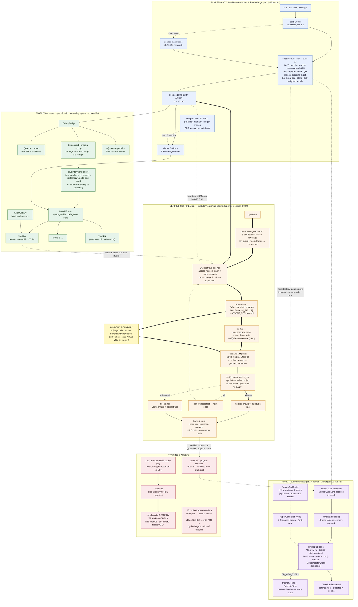

# CubbyLLM — full system diagram

**As of 2026-08-08** (post serve-stack cycle). Solid arrows = the live default
path; dotted = gated/optional or future; thick = the verified CoT traversal.
Every component below exists in code unless marked *(future)*.

## Reading the diagram

- **Fast semantic layer** (blue): the model-free serving substrate. One table
  lookup + IDF bundle produces a qFHRR block code carrying real semantics
  (0.97× its teacher on routing); the dense form is the quality ceiling, the
  80-byte compact form is the scale/storage/algebra form. Everything else
  consumes these codes.
- **Worlds** (green): specialization as routing. The bridge's tiers are
  ordered by cost; every τ is deployment-calibrated; a wrong route is
  recoverable by spawn, and a world missing an answer *asks the next world*
  (measured: flat-search answer quality at ~1/60 the comparisons).
- **CoT pipeline** (orange, thick path): the verified traversal — the first
  full Cubby→CubeLang→output loop. An answer is only *claimed* when every hop
  clears its threshold and the absent-role control stays silent; everything
  else is an honest refusal with a partial trace. All outcomes are harvested
  as verified supervision.
- **Symbolic boundary** (yellow): the two VSA algebras (grilly block codes;
  the Rust VM's dense bipolar codes) never exchange raw vectors — concepts
  in, `(symbol, similarity)` out. This is deny-by-default applied to
  representations.
- **Trunk** (purple): the hybrid LM. The retrieval head is softmax-free; the
  memory layer interleaves retrieval into the stack; θ=f(c) with an
  offline-frozen context router is the validated anti-forgetting mechanism.
- **Training** (red): current assets and the panel-settled 2B runbook. The
  harvest→SFT arrow is the system's self-improvement loop: today's hand
  grammar generates the training data for the model that replaces it.
