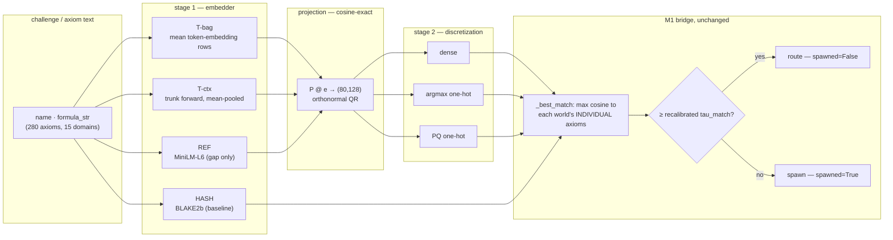

# H-F2 M2 — Semantic Context Encoding (design)

**Status:** design, approved 2026-08-06. Successor to M1 (`2026-08-06-hf2-worldmodel-bridge-design.md`, merged).
**Revision (2026-08-06):** NV-Embed is **out** — that codebook was a test artifact. M2 uses **our own trunk embeddings**, measured against a small pretrained reference. The corpus is mowm's own registered axioms, not an external file.

> ## OUTCOME (2026-08-06) — the gate CLOSED at Task 6; §4.3 was NOT built
>
> **Three of Stage 1's four bars FAILED**, so the decision rule's `trunk < 0.60 × REF` branch fired and the milestone ended at Task 6 with a negative result. **§4.3's live confirm and §6's `mowm/encoding/semantic_axioms.py` were never built** — mowm has no semantic axiom path, and M1's shipped bridge is unchanged. That is the screen working as designed, not an unfinished milestone.
>
> **This spec has since drifted from what actually ran** and is amended below rather than rewritten, so the drift stays visible: §4's Stage 1 gained a fifth arm (**`ngram`**, the milestone's most load-bearing control — a training-free lexical sketch that *beat both trunk arms* on macro) and Stage 2 gained a fourth variant (**`pq-adc`**); §6's single log filename was never created and is replaced with the files that exist; the Stage-2 "quantization improves routing" result was later **RETRACTED** as a codebook-leakage artifact.
>
> **The authoritative record of what M2 measured and concluded is `CUBBYLLM_HYPOTHESES.md`, entry "H-F2 M2 screened (2026-08-06)"** — read it, not this section's forward-looking prose, for any number or verdict. Every figure there links a file in `validation/logs/`.

**Depends on:** M1's shipped `CubbyBridge` (CubbyLLM `master` `2e61be4` / mowm `master` `5584834`); the trained trunk `D:\CUBBY-TRAINED-MODELS\hd5_mem21.pt`; `data/grillcheese_bbpe128k.json`; mowm's `domains/*.py` axioms; the decided **k=80 / l=128** algebra (H-B5).

> **Note on the two mowm commits (reconciled 2026-08-06, no conflict).** This line pins mowm `5584834`, the M1 merge, because that is the bridge M2 depends on. `data/mowm_axioms.json`'s `_provenance.mowm_commit` records **`bd1f092`**, because that was mowm's live `HEAD` when the corpus was exported — the user committed their own working tree on top of the M1 merge mid-cycle. The two differ legitimately: one is the *dependency* pin, the other is the *export* provenance. `bd1f092` touches no axiom source (the export returned exactly 280 axioms / 15 domains / physics 84, matching the ground truth taken at `5584834` with no adjustment), so the corpus is the same either way.

---

## 1. Why M2 exists — the finding M1 deferred

M1 shipped three-tier route-vs-spawn (exact-tag memo → similarity route → spawn-on-novel) and deferred one question: *do real challenge contexts land near axioms, so the similarity tier fires?*

**The answer is no, and it is structural — no challenge-side encoder can fix it alone.** `WorldEncoder._hash_to_vec` (`cubemind/execution/world_encoder.py:48-64`) is BLAKE2b-seeded RNG, and axiom vectors are built *from* it (`axiom_library.py:127-138`: `bind(domain_vec, bind(name_vec, formula_vec))`). Hashing is designed to destroy locality, so `"Force equals mass times acceleration"` and `"what force accelerates 2 kg?"` yield **unrelated** codes. M1's similarity tier can therefore only fire on a context reproducing the *same symbolic strings* — which is exactly why M1's fuzzy test had to build its context by perturbing a real axiom.

M2 is therefore not a test but a build-and-validate: **give both sides a shared semantic space, then prove the shipped bridge routes organically.**

## 2. What already exists (verified 2026-08-06)

| Asset | Where | What it gives us |
|---|---|---|
| Trained trunk | `D:\CUBBY-TRAINED-MODELS\hd5_mem21.pt` | `meta = {D:512, L:8, backbone:'hybrid', attn_every:3, heads:8, window:512, mem_every:2, mem_key:64, mem_topk:8, gen:'basis', vocab:127996}`; 109 tensors, 153.4M params |
| Reconstruction recipe | `validation/train_colab.py:401-402` (save), `:414-420` (reload) | Saves `params` in `model.parameters()` order; reload rebuilds via `build(vocab, dev)`, asserts `meta` equality **and** tensor count, then copies in order — self-validating |
| Tokenizer | `data/grillcheese_bbpe128k.json` (9.3 MB) | HF `tokenizers` BPE; 127,933 vocab + 67 added (4 opcodes already in-vocab ⇒ 63 new) = **127,996**, matching the checkpoint exactly. Loader: `cubbyllm.training.data._load_tokenizer` ("`.json` BBPE or `.model` SP") → `(encode, decode, eos_id, vocab)` |
| Orthonormal projection | `mowm/sequence_encoder.py:76-79`, `:219-242` | Full-QR when `k*l >= latent_dim`; `P @ e` → `(k,l)` dense float32 |
| Axiom corpus | `mowm/domains/*.py` | **280 axioms across 15 domains** (physics 84; **atomic 17**; bio/causal/colors/economics/ensemble/historical/language/logic/security 15 each; linguistics 12; music 11; social 11; identity 10), each with `name`, dotted `domain`, `formula_str`. *(Corrected 2026-08-06: this row read `atomic … 15`, which made the listed counts sum to 278, not 280 — under a "verified" heading. Re-derived from `data/mowm_axioms.json`; 84 + 17 + 9×15 + 12 + 11 + 11 + 10 = 280.)* |
| M1 similarity tier | `mowm/bridges/cubby_bridge.py` | `_best_match` = max cosine of context to each world's **individual** axioms; `_cosine` ravels, so dense vectors work unchanged |

**Analytic consequence (load-bearing).** An orthonormal projection preserves cosine **exactly**: `(Px)·(Py) = xᵀPᵀPy = x·y`, `‖Px‖ = ‖x‖`. With a 512-D trunk embedding and `k·l = 10240 ≫ 512`, the QR path applies with *more* headroom than a 4096-D embedder had. **Projecting into VSA space is free; it is not where quality is lost.**

## 3. The actual gap

1. **Axioms are hash-encoded**, so a semantically encoded challenge is compared against hashes — cosine ≈ 0. Both sides must share one space. *This is what M2 closes.*
2. **`tau_match` is calibrated for the wrong distribution** — M1's `0.35` assumed one-hot codes at k=4 (cosine quantized to `{0,.25,.5,.75,1}`). It must be re-derived from data.
3. **Discretization is unvalidated.** One-hot-per-block is what the VSA algebra assumes; quantizing a dense semantic vector to one-hot is where locality can die.
4. **Our embedder is unmeasured.** The trunk body is small (most of its 153M params are the 128k×512 embedding table; the D=512/L=8 body is ~22M), so mean-pooled quality is a genuine open question — which is why a reference arm exists.

## 4. Approach — rank embedders, then settle discretization

Run in two stages rather than a 4×3 cross-product (7 runs, each answering one question).

### Stage 1 — which embedder? (all dense, i.e. cosine-exact)

| Arm | Encoding | Role |
|---|---|---|
| **HASH** | `_hash_to_vec` (M1 status quo), reimplemented in ~5 lines | Baseline — predicted ≈ chance |
| **NGRAM** *(added mid-cycle)* | Character-trigram block codes bundled by superposition — no model, no training, no projection, born directly in block space | **The stronger training-free null.** Added after the user's VSA-locality proposal; it *beat both trunk arms* on macro (0.1400 = 2.10× chance), which is why `hash` must not be presented as the only baseline the trunk had to clear |
| **T-bag** | Mean of the trunk's trained token-embedding rows (`params[0]`, 127996×512) over the text's tokens | Ours; **no model reconstruction** |
| **T-ctx** | Full `CubbyModel` forward, mean-pooled final hidden states | Ours, contextual |
| **REF** | Small pretrained sentence embedder (MiniLM-L6-v2, 384-D, ~22M) | Reference — measures the gap, nothing more |

Because dense projection is cosine-exact, Stage 1 measures embedder quality directly.

> **Amendment (2026-08-06).** This table listed **four** arms; five ran. `NGRAM` above is the addition, and it is the milestone's most load-bearing control — omitting it here would leave the spec claiming the trunk only ever had to beat a hash. `HASH`'s role also read "predicted ≈ majority-class", which is a *micro* baseline for a *macro* prediction (see §4.1's correction); it is the chance level for whichever metric is being read.

### Stage 2 — which discretization? (winning embedder only — in the event, **two** arms ran)

- **dense** — `P @ e` reshaped `(80,128)`
- **argmax** — one-hot at the max signed value per block (LSH-style on a random-orthonormal projection)
- **PQ** — one-hot at the nearest of `l=128` per-block centroids, k-means fit on the axiom embeddings (hand-rolled Lloyd's, fixed seed; no scikit-learn)
- **PQ-ADC** *(added mid-cycle)* — Asymmetric Distance Computation: the query stays **dense** and only the stored side is quantized, then **reconstructed to its centroid vectors**. Architecturally motivated rather than an accuracy trick — axioms must be one-hot to participate in `bind`/`bundle`, but a routing query never needs quantizing

One-hot cosine is `(#matching blocks)/k` — at k=80 that is 81 levels, versus toy k=4's five.

> **Amendment (2026-08-06).** This list had **three** variants; four ran, and Stage 2 ran on **two** arms rather than the single winner: `t-ctx` (the spec's required winning-trunk arm) *and* `ref`, because `t-ctx` sits so near chance that a dense-relative bar 4 on it alone would have been measured against noise. **Both additions' headline result was later RETRACTED**: `pq-adc` > `pq` > `dense` was a codebook-leakage artifact (the codebook was fit on the very items leave-one-out excludes), and the honest conclusion is that this corpus **cannot settle** the discretization question — it needs `n ≫ L`, ~1280 axioms for `L=128`, with a fit set disjoint from the scored items. See the hypotheses entry.

### 4.1 Metric

**Two measurements, both by leave-one-out over all 280 axioms** (LOO beats a split on a corpus this small — 280 evaluations instead of ~90), and **cross-view so nothing is authored**: seeds are encoded from `formula_str`, challenges are posed as `name`.

> **Not run (corrected 2026-08-06).** An earlier draft of this line claimed "the reverse direction is reported too". It is not: `run_stage1` measures name→formula only. The reverse adds no information for the verdict (both directions share one symmetric cosine matrix; only the argmax axis differs), so it is dropped rather than deferred — recorded here because a spec that claims a measurement the code never takes is exactly the failure mode this repo tracks.

- **Self-retrieval (encoder sanity):** does `name_i` retrieve `formula_i` as top-1 among all 280 formulas? Tests only that the encoder pairs two surface forms of one concept.
- **Domain routing (the real metric, mirroring `_best_match`):** hold out axiom *i* **including its own formula**, seed one world per domain from the remaining axioms, route `name_i` to the world holding the single highest-cosine individual axiom, and check the top-level domain. Excluding its own formula is deliberate: in production a new challenge must reach the right world via *other* axioms, not by matching itself.

**Report both micro and macro (per-domain mean) accuracy — each against its own chance level.** The corpus is imbalanced (physics is 84/280 = 30%) and max-over-individual-axioms favours larger worlds, so the two metrics have *different* trivial baselines and must never be compared across:

- **Micro** chance = the **majority-class rate, ~0.300** — what "always guess physics" scores.
- **Macro** chance = **1/15 ≈ 0.067** — macro-averaging removes the imbalance by construction, so *any* constant or uniform-random classifier scores exactly `1/n_domains`, the majority-class strategy included.

> **Correction (2026-08-06, from the Stage-1 run).** An earlier draft of this section asserted that the majority-class rate was the honest chance level "not 1/15", full stop. That is right for micro and **wrong for macro**, and the kill criterion below compares macro — a category error that made bar 1 pass trivially and bar 3a demand an unreachable macro of 0.60. Fixed here and in the code; the measured verdict was unchanged by it.

### 4.2 Kill criterion

1. **Baseline sanity:** `HASH macro-acc ≤ 1.2 × macro-chance (1/n_domains)`. If HASH routes well, §1 is wrong — stop and redesign.
2. **Encoder sanity:** the best trunk arm reaches **self-retrieval top-1 ≥ 0.50**. Below that the trunk does not pair surface forms at all and no routing result is interpretable. *(Calibration caveat, learned from the run: this corpus poses `name` against `formula_str`, i.e. natural language against symbolic notation — a **cross-modal** match harder than production routing. 0.50 was set for a same-modality task; even a strong pretrained reference scores **0.229** here (`validation/logs/exp_f2m2_stage1.json`, arm `ref`), so read this bar as diagnostic rather than decisive. Note this caveat was written **after** the run and retroactively softens a bar that FAILED — treat it as context for interpreting the failure, not as a reason to discount it.)*
3. **Routing bar:** the best trunk arm reaches **macro-acc ≥ 2 × macro-chance** *and* **≥ 0.60 × REF macro-acc**.
4. **Discretization bar:** the best discretized arm reaches **≥ 0.80 × its dense counterpart**.

**Decision rule (what the numbers buy).** `trunk ≥ 0.90 × REF` → ship the trunk (ours, zero external deps). `trunk < 0.60 × REF` → the gap justifies fine-tuning a small embedder, which becomes M3 with a measured motivation. In between → documented judgment call. **If both discretized arms fail bar 4 while dense passes**, the reportable finding is *semantic routing works only in dense space*, forcing an explicit dense-vs-one-hot architectural choice rather than a silent one.

**Threshold recalibration.** For the winning configuration, take the max-cosine distributions for same-domain vs different-domain challenges, report ROC-AUC, and set `tau_match` at the point maximizing Youden's J. That value — not M1's `0.35` — is what the live confirm uses.

### 4.3 Live confirm — **NOT BUILT (gated out 2026-08-06)**

> **This section never ran.** It is conditional on "once an arm wins", and no arm won: bars 2, 3a and 3b all FAILED, so the kill criterion closed the gate at Task 6. Nothing below exists in either repo — no `mowm/encoding/semantic_axioms.py`, no `tests/test_semantic_routing.py`, no recalibrated `tau_match` in the shipped bridge (`WorldEncoder`'s hash encoding and M1's `CubbyBridge` are byte-identical to their M1 state). **Also note the premise is now doubly unavailable:** §4.3 step 3 requires "the recalibrated `tau_match`", and M2 produced no usable one — every Stage-2 threshold is either in an incomparable space or drawn from the retracted leakage result, so M1's `tau_match = 0.35` stands unreplaced. Kept as written, unticked, because a design whose gate closed is a *result*; see `CUBBYLLM_HYPOTHESES.md`, H-F2 M2.

Once an arm wins and `tau_match` is recalibrated, prove it through the **real shipped bridge**, additively:

1. Build a real `AxiomLibrary(k=80, l=128)` and register `Axiom(...)` objects whose `.vector` is the semantically encoded vector — constructing `Axiom` directly, **not** via `make_axiom`, so mowm's hash path is untouched.
2. Seed one real `World` per domain from those axioms; add them to a real `MoWMRouter`.
3. Drive held-out challenges through `CubbyBridge.attempt()` with the recalibrated `tau_match`.
4. **Assert:** organic challenges route (`spawned=False`) to their own domain at **≥ 0.90 ×** the screened macro-accuracy; an out-of-domain challenge still spawns (`spawned=True`); and M1's exact-tag repeat still reuses without a second spawn.

This is the first time the bridge sees contexts that were not constructed from the axioms they must match.

## 5. Data flow

**Challenge source for M2 = text.** Encoding CubbyLLM's *live* trunk context `c` (rather than text through the trunk) is deferred — the same projection applies, but it needs the trunk in the serving path.

## 6. Components and file structure

**CubbyLLM:**
- `data/mowm_axioms.json` — the 280 axioms exported once from mowm (`name`, `domain`, `formula_str`). Keeps the screen free of any cross-repo import.
- `validation/exp_f2m2_semantic_routing.py` — both stages, the metric, the kill criterion, threshold recalibration, the leakage controls, and the null baseline. Standalone; never imported by `cubbyllm/`.
- `validation/logs/exp_f2m2_*.{log,json}` — teed output plus a machine-readable artifact per run, each with an environment stamp (per the persist-experiment-logs rule). **The single `exp_f2m2_semantic_routing.log` this line originally named was never created** — one mode per file turned out to be the right shape once Stage 2 ran on two arms and the leakage controls were added. What exists:

  | File | Produced by |
  |---|---|
  | `exp_f2m2_selftest.log` | `--self-test` |
  | `exp_f2m2_stage1.{log,json}` | `--stage1` (5 arms) |
  | `exp_f2m2_stage2_ref.{log,json}`, `exp_f2m2_stage2_t-ctx.{log,json}` | `--stage2 ARM` (4 variants each) |
  | `exp_f2m2_leakage_ref.{log,json}`, `exp_f2m2_leakage_t-ctx.{log,json}` | `--leakage-check ARM` — the control that retracted the Stage-2 headline |
  | `exp_f2m2_null_baseline.{log,json}` | `--null-baseline` — the measured nulls for macro / micro / ROC-AUC |

- `data/axiom_embeddings_ref.npz`, `data/axiom_embeddings_t-ctx.npz` — exported by `--stage2`. **A record of the screen, not a configuration**: nothing reads them, their `discretization`/`tau_match` come from the retracted `pq` variant, and their `centroids` *are* the leakage-contaminated codebook. Each carries that warning in its own `note`/`retracted` fields.
- `CUBBYLLM_HYPOTHESES.md` — the H-F2 M2 result, stated honestly, including a negative outcome. **This is the authoritative record.**

**mowm (additive only) — NOT BUILT, gated out at Task 6:**
- ~~`mowm/encoding/semantic_axioms.py`~~ — builds `Axiom` objects carrying semantic `.vector`s using the winning encoder. **Must not modify `make_axiom`, `WorldEncoder`, or any hash behavior.**
- ~~`tests/test_semantic_routing.py`~~ — the live confirm (§4.3).

> Neither mowm file exists. The Stage-1 kill criterion closed before Task 7, so no semantic path was wired into a bridge the screen had just shown does not route. Deliberately unbuilt — do not read these two lines as a TODO.

**Dependency direction unchanged:** mowm → cubbyllm only. The screen imports neither mowm nor cubemind (it reads the exported JSON and reimplements the 5-line hash baseline), honoring "port reusable pieces, never cross-repo-depend on cubemind."

## 7. Constraints

- **k=80, l=128 (d=10240)** — the decided H-B5 algebra, not M1's toy k=4/l=32.
- **Deterministic:** fixed seeds for projection, k-means, and any sampling. CPU is sufficient; the trunk forward may use DirectML if convenient but must not require it.
- **Green suites stay green:** CubbyLLM `python -m pytest tests -q` (108 at spec time → **111** once Task 1 added the corpus tests; `validation/` is not package code, so every later task held it at 111) and mowm `uv run pytest tests/ -q` (741 at spec time; never re-measured because no mowm task ran). M2 is additive.
- **Numbers cite logs:** every figure quoted in docs links the `validation/logs/` file that produced it.
- **Commit conventions:** CubbyLLM commits carry the Opus-5 + Claude-Session trailers; mowm commits use mowm's own style with none.
- **The user's uncommitted mowm working-tree files are never staged, stashed, or modified.**

## 8. Risks

- **Small corpus.** 280 axioms, imbalanced, formulaic. LOO-CV and macro-accuracy mitigate but do not eliminate this; report per-domain results so a single dominant domain cannot hide a weak encoder.
- **Trunk quality unknown.** The body is ~22M params at D=512/L=8; mean-pooling an LM is a mediocre sentence embedder in general. This is precisely what bar 3 measures, and a failure is a *finding* (fine-tune, i.e. M3), not a dead end.
- **Reconstruction drift.** `build()` must produce exactly 109 tensors whose shapes match the checkpoint, and `meta` must match; the loader asserts both (`train_colab.py:414-420`). If it fails, **T-bag still works** without any reconstruction — the trunk arm degrades rather than disappears.
- **`World` cost at k=80/l=128.** M1 tested at k=4/l=32; each `World` builds HYLAs with `d_out=10240` (`world.py:132-144`). The live confirm verifies construction time/memory early and reduces world count or `n_hylas` if needed — routing itself never touches HYLA, only `predict` does.
- **Dense vs one-hot algebra.** If only dense works, `bind`/`bundle` semantics on dense vectors become an open question. M2 reports it; it does not silently ship dense vectors into the algebra.

## 9. Explicitly deferred

Fine-tuning or training a dedicated embedder (M3, gated on the measured gap); live trunk-context encoding in the serving path; cross-world data-sharing; the bidirectional MoWM→Cubby feedback path; SR axiom discovery, imagination rollouts, multimodal challenges; global re-encoding of mowm's axioms away from hashes.
