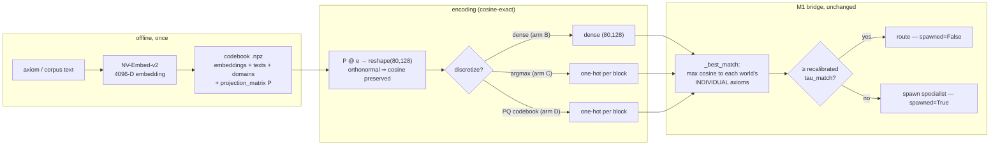

# H-F2 M2 — Semantic Context Encoding (design)

**Status:** design, approved 2026-08-06. Successor to M1 (`2026-08-06-hf2-worldmodel-bridge-design.md`, merged).

**Depends on:** M1's shipped `CubbyBridge` (`mowm/bridges/cubby_bridge.py`, CubbyLLM `master` `2e61be4` / mowm `master` `5584834`); mowm's `SequenceEncoder`, `AxiomLibrary`, `MoWMRouter`, `World`; the `mowm_nvembed_codebook.npz` artifact; grilly block codes at the decided **k=80 / l=128** algebra (H-B5).

---

## 1. Why M2 exists — the finding M1 deferred

M1 shipped three-tier route-vs-spawn: exact-tag memo → similarity route → spawn-on-novel. Its whole-branch review deferred one question: *do real challenge contexts land near axioms, so the similarity tier fires?*

**The answer is no, and it is structural — no challenge-side encoder can fix it alone.**

`WorldEncoder._hash_to_vec` (`cubemind/execution/world_encoder.py:48-64`) is BLAKE2b-seeded RNG:

```python
digest = hashlib.blake2b(text.encode("utf-8"), digest_size=8).digest()
seed = int.from_bytes(digest, "little") % (2**63)
return self.bc.random_discrete(seed=seed)
```

Axiom vectors are built *from* that hash (`AxiomLibrary.make_axiom`, `axiom_library.py:127-138`: `bind(domain_vec, bind(name_vec, formula_vec))`, each `*_vec = encoder.encode_action(text)`). Hashing is designed to destroy locality, so `"Force equals mass times acceleration"` and `"what force accelerates 2 kg?"` produce **unrelated** codes. M1's similarity tier can therefore only fire on a context reproducing the *same symbolic strings* — which is exactly why M1's fuzzy test had to construct its context by perturbing a real axiom.

M2 is therefore **not a test**. It is: *build the semantic encoding that makes similarity routing possible, validate it, and prove the shipped bridge routes organically.*

## 2. What already exists (verified 2026-08-06)

Substantially more than expected — the embedding→VSA projection is already built:

| Asset | Where | What it is |
|---|---|---|
| `SequenceEncoder.from_codebook()` | `mowm/sequence_encoder.py:333-352` | Builds an encoder from the `.npz` with its stored `k`/`l`/`projection_matrix` |
| `_project_embedding()` | `mowm/sequence_encoder.py:219-242` | `P @ embedding` → reshape `(k, l)`. **Dense float32, no discretization** |
| Orthonormal `P` | `mowm/sequence_encoder.py:76-79` | Full-QR when `k*l >= latent_dim` → "columns are orthonormal, preserves cosine exactly" |
| NV-Embed codebook | `mowm_nvembed_codebook.npz` (untracked, in-tree) | `embeddings (166894, 4096)` · `texts (166894, 149079 unique)` · `domains (16)` · `centroids (16, 4096)` · `projection_matrix (10240, 4096)` · `k_vsa=80`, `l_vsa=128` · `model_id='nvidia/NV-Embed-v2'` |
| Centroids already projected to VSA | `mowm/qa/classifier.py:230-259` | Existing precedent for projecting NV-Embed into VSA space for domain scoring |
| M1 similarity tier | `mowm/bridges/cubby_bridge.py` `_best_match` / `_cosine` | Max cosine of context to each world's **individual** axiom vectors; `_cosine` ravels, so it works on dense vectors unchanged |

**Analytic consequence (load-bearing).** An orthonormal projection preserves cosine **exactly**: `(Px)·(Py) = xᵀPᵀPy = x·y` and `‖Px‖ = ‖x‖`. So projecting NV-Embed embeddings into the (80,128) VSA space costs *nothing* in routing quality. **The projection is not the hard part, and it is already built.**

## 3. The actual gap

Three things, in order of importance:

1. **Axioms are still hash-encoded.** A challenge can be projected into semantic VSA space today, but it is compared against hash-derived axiom vectors — cosine ≈ 0. Both sides must share one space. *This is the gap M2 closes.*
2. **`tau_match` is calibrated for the wrong distribution.** M1's `0.35` was set for one-hot codes at k=4, where cosine is quantized to `{0, .25, .5, .75, 1.0}`. Dense semantic vectors have a continuous distribution with a high similarity floor; the threshold must be re-derived from data.
3. **Discretization is unvalidated.** M1's block codes are one-hot-per-block, which is what the VSA algebra (`bind`/`bundle`) assumes. Quantizing a dense semantic vector to one-hot is where locality can be destroyed — and is the one place a *learned* codebook could beat the existing random-orthonormal projection.

## 4. Approach — a five-arm screen, then a live confirm

Because the orthonormal projection is cosine-exact, "random projection vs learned projection" is not a real contest for **dense** routing (arm B ≡ arm E analytically). The genuine question is **discretization**, so the head-to-head is restated as:

| Arm | Encoding | Role |
|---|---|---|
| **A** | `WorldEncoder._hash_to_vec` (M1 status quo) | Baseline — predicted ≈ chance |
| **B** | Dense orthonormal projection `P @ e` → `(80,128)` | Cosine-exact; predicted ≡ E |
| **C** | One-hot per block via **argmax** of the projected block (Approach 1) | Cheap discretization |
| **D** | One-hot per block via a **learned PQ codebook** fit on the labeled embeddings (Approach 3) | Learned discretization |
| **E** | Raw 4096-D NV-Embed cosine | True ceiling |

Arms C and D are directly comparable: both emit one-hot-per-block codes, so their cosine is `(#matching blocks)/k` — at k=80 that is 81 distinct levels, far more resolution than toy k=4's five.

- **Arm C detail:** one-hot at `argmax` of the raw (signed) projected value within each block — an LSH-style rule on a random-orthonormal projection.
- **Arm D detail:** product quantization — for each of the k=80 blocks, k-means the corresponding 128-D sub-vectors of the training embeddings into `l=128` centroids; the code is the nearest-centroid index per block.

### 4.1 Metric and kill criterion

**Metric — domain-routing accuracy, mirroring M1's actual routing rule.** Each domain is a world seeded with held-in "axiom" texts. A held-out "challenge" text routes to the world holding the **single highest-cosine individual axiom** (exactly `_best_match`'s max-over-individual-axioms rule). Accuracy = fraction routed to the challenge's own labeled domain.

The screen **passes** iff, on the held-out split:

1. **Ceiling sanity:** `|acc_B − acc_E| ≤ 0.01` — empirically confirms the cosine-preservation claim. A larger gap means a bug, not a finding.
2. **Baseline sanity:** `acc_A ≤ 1.5 × chance` — confirms §1's structural claim. If arm A routes well, §1 is wrong and M2's premise collapses (report it, stop, redesign).
3. **Winner bar:** at least one discretized arm (C or D) reaches `≥ 0.80 × acc_E`.

**Winner selection.** Among the discretized arms clearing bar 3, take the higher held-out accuracy. If they are within 0.01 of each other, prefer **C** — it needs no fitted artifact to version, persist, or refit for unseen text.

If **both C and D fail bar 3** while B/E succeed, that is a real, reportable negative result: *semantic routing works only in dense space*, forcing an explicit architectural choice (dense codes vs the one-hot VSA algebra) — carried to the hypotheses doc, not papered over.

**Threshold recalibration.** For the winning arm, take the max-cosine distributions for same-domain vs different-domain challenges on the held-out split, report ROC-AUC, and choose `tau_match` at the point maximizing Youden's J. That value — not M1's 0.35 — is what the live confirm uses.

### 4.2 Data protocol

- **Domains.** Use only well-populated, genuinely distinct domains: `linguistics, economics, identity, language, logic, physics, bio, social, historical, security` (**10 domains → chance = 10%**). Exclude `general` (80,225 texts, a catch-all that semantically overlaps every other domain and would be a routing sink) and the sparse domains `ensemble` (179), `causal` (177), `atomic`/`music`/`colors` (4 each).
- **Deduplicate by exact text before splitting** — the codebook has 166,894 rows but only 149,079 unique texts, so duplicates would otherwise leak an identical string across the axiom/challenge split and inflate every arm.
- **Sampling (fixed seed).** Per domain: **200** held-in axiom texts + **500** held-out challenge texts → 700 unique texts per domain, 2,000 axioms and 5,000 challenges overall. Every selected domain has ≥ 2,000 *rows* before dedup; the script must assert each still supplies ≥ 700 *unique* texts after dedup and fail loudly (never silently sample with replacement or shrink a domain) if one does not. (Sizes are parameters, not constants.)
- **Expected confusion.** `language` vs `linguistics` overlap semantically; treat confusion between them as an expected characteristic to report, not a defect.
- **CPU-only, no model download.** The screen consumes the codebook's *precomputed* embeddings, so NV-Embed-v2 (~7B params) is never loaded — matching the CPU-only validation campaign. Arm D's k-means and all cosines are numpy/BLAS matmuls at this size.

### 4.3 Live confirm (the part that closes M1's question)

Once an arm wins and `tau_match` is recalibrated, prove it through the **real shipped bridge**, additively:

1. Build a real `AxiomLibrary(k=80, l=128)` and register `Axiom(...)` objects whose `.vector` is the **semantically encoded** vector (constructing `Axiom` directly, *not* via `make_axiom`, so mowm's hash path is untouched).
2. Seed one real `World` per domain from those axioms; add them to a real `MoWMRouter`.
3. Drive real held-out challenges through `CubbyBridge.attempt()` with the recalibrated `tau_match`.
4. **Assert:**
   - **Organic routing** — held-out challenges route (`spawned=False`) to their own domain's world at **≥ 0.90 × the winning arm's screened accuracy** (the tolerance absorbs the smaller live sample), rather than spawning.
   - **Specialization preserved** — a genuinely out-of-domain challenge still spawns (`spawned=True`). Source it from data, not construction: a text from an **excluded** domain (`music`, `colors`, `atomic`), which no seeded world covers.
   - **M1's controls stay green** — exact-tag repeat still reuses without a second spawn.

This is the first time the bridge is exercised with contexts that were not constructed from the axioms they must match.

## 5. Data flow



**Challenge source representation for M2 = text.** The trunk-hidden-state variant (project CubbyLLM's inferred context `c` into the same space) needs a trained projection from trunk space and is **deferred**; the codebook gives text→embedding for free and answers the routing question without it.

## 6. Components and file structure

**CubbyLLM (validation only — no package code changes):**
- `validation/exp_f2m2_semantic_routing.py` — the five-arm screen + threshold recalibration. Standalone, never imported by `cubbyllm/`, consistent with the existing 15 validation scripts.
- `validation/logs/exp_f2m2_semantic_routing.log` — full teed output with an environment stamp (per the persist-experiment-logs rule).
- `CUBBYLLM_HYPOTHESES.md` — the H-F2 M2 result, honestly stated, including a negative outcome if C and D both fail.

**mowm (additive only):**
- `mowm/encoding/semantic_axioms.py` — turns text + the codebook into `Axiom` objects carrying semantic `.vector`s, using the winning arm's encoder. **It must not modify `make_axiom`, `WorldEncoder`, or any existing hash behavior** — it is a parallel path, not a replacement.
- `tests/test_semantic_routing.py` — the live confirm.

**Dependency direction is unchanged:** mowm → cubbyllm only. The CubbyLLM validation script importing mowm is a deliberate, bounded exception — `validation/` is explicitly not package code and nothing under `cubbyllm/` imports it.

## 7. Constraints

- **Dimensions: k=80, l=128 (d=10240)** — the decided H-B5 algebra and the codebook's own `k_vsa`/`l_vsa`. Not M1's toy k=4/l=32, which has only ~20 bits of resolution and would falsify semantic locality for the wrong reason.
- **CPU-only, deterministic.** Fixed seeds for sampling, k-means, and any projection; no GPU or model download required for the screen.
- **Green suites stay green:** CubbyLLM `python -m pytest tests -q` (108) and mowm `uv run pytest tests/ -q` (741). M2 is additive; a changed count must be additions only.
- **Numbers cite logs.** Every figure quoted in docs links the `validation/logs/` file that produced it.
- **Commit conventions:** CubbyLLM commits carry the Opus-5 + Claude-Session trailers; mowm commits use mowm's own style with none.
- **The user's uncommitted mowm working-tree files are never staged, stashed, or modified.**

## 8. Risks

- **`World` construction cost at k=80/l=128.** M1's tests ran at k=4/l=32. At d_vsa=10240 each `World` builds HYLAs with `d_out=10240` (`world.py:132-144`). The live confirm must verify construction time/memory early and, if heavy, reduce world count or `n_hylas` — the routing decision itself never touches HYLA, only `predict` does.
- **Dense codes vs the one-hot VSA algebra.** If dense (arm B) is the only thing that works, `bind`/`bundle` semantics on dense semantic vectors become an open question. M2 reports this; it does not silently ship dense vectors into the algebra.
- **Real axiom texts may not be in the codebook.** The screen routes codebook-text→codebook-text. Encoding mowm's *actual* `domains/*.py` axioms requires one offline NV-Embed pass to produce a cached axiom-embedding artifact — the same "offline-pretrained, frozen at inference" shape H0 already validated. In scope only if the screen passes.
- **NV-Embed at inference time.** Encoding a *live* challenge needs the 7B model. Out of scope for M2 (which uses precomputed embeddings); a caching/serving decision for a later slice.

## 9. Explicitly deferred

Cross-world data-sharing to complete a challenge; the bidirectional MoWM→Cubby feedback path (context/task embedding both ways + generated-parameter handles); SR axiom discovery, imagination rollouts, multimodal challenges; trunk-hidden-state challenge encoding; global re-encoding of mowm's axioms away from hashes.
