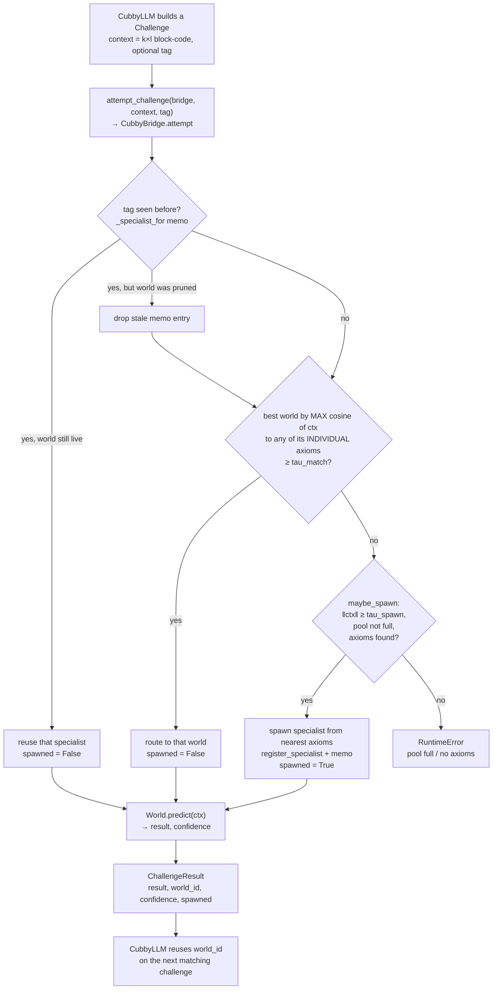

# H-F2 World-Model Bridge (M1: Automatic Specialization) — Design Spec

**Date:** 2026-08-06
**Author:** Nicolas Cloutier + Claude
**Status:** Draft
**Modules:** `cubbyllm/bridges/` (CubbyLLM) + `mowm/bridges/` (MoWM)
**Depends on:** the existing `WorldModelBridge` Protocol (`cubbyllm/bridges/world_model.py`); MoWM's `MoWMPipeline` (`route → maybe_spawn → predict`, verified green 2026-08-06, 738 tests); grilly block-codes shared by both.

## 1. Overview and motivation

H-F2 is the concrete Cubby↔CubeMind bridge. This spec defines its **first buildable slice (M1): automatic specialization** — the one capability the H-F2 hypothesis actually claims, and the smallest thing that proves the bridge is real rather than a stub.

**The interaction.** CubbyLLM offloads a *challenge* it can't reliably answer itself — grounded, causal, or multi-step reasoning — to MoWM (the Mixture-of-World-Models). MoWM's expert worlds attempt the challenge against their axioms; **if no world fits, MoWM grows a new specialist world for it** and hands it back so CubbyLLM can reuse it. Posing the same challenge again routes to that specialist.

**Why this shape (literature-grounded).** The 2026 *World Models* survey measured that LLMs learn *correlational, not causal* world models (GPT-4 drops below 1% cumulative accuracy after 10 transition steps; ByteSized32) and showed the fix is exactly this pattern: a causal world model the LLM **queries** beats pure-LLM reasoning, especially at longer horizons (Gkountouras et al.). RAP casts the system as "LLM proposes / world-model evaluates," and FutureX's "auto-think" invokes the world model **on demand** when a challenge warrants deliberation — precisely the "challenge" trigger. Because MoWM and CubbyLLM share the **grilly block-code substrate** (and both are θ=f(c)/HYLA systems), the bridge can carry raw block-code state natively — unlike the reasoning-bridge slice, which needed a symbolic-only boundary (the trunk's grilly algebra and cubelang's *Rust* VSA are non-interoperable families; MoWM's `BlockCodes` and CubbyLLM's `ops.BlockCodeVSA` both wrap grilly, so they are the *same* family).

**MoWM's structure (owner's model).** One Global World (the shared axiom/data library) → many expert Worlds (each specialized) → data, and data is shareable across worlds to complete a challenge. A *challenge* is the unit of work; M1 proves single-world completion + specialization; cross-world data-sharing is deferred to M2.

## 2. Architecture — two sides, one Protocol, block-code boundary

The coupling is **Protocol-first with a MoWM-side adapter** (decided 2026-08-06):

```
   CubbyLLM repo                         MoWM repo
   ------------                          ---------
   WorldModelBridge (Protocol)   <—imports—   CubbyBridge (adapter)
   FakeWorldModel (test double)                 └ wraps MoWMPipeline
   attempt_challenge() flow                       (route → maybe_spawn → predict)
        │                                              │
        └────────── block-code Challenge ──────────────┤
        ┌────────── block-code ChallengeResult ─────────┘
```

- **CubbyLLM side** (`cubbyllm/bridges/`): the `WorldModelBridge` Protocol + a small deterministic **`FakeWorldModel`** (in-repo test double) + a thin `attempt_challenge()` flow CubbyLLM uses to consult a world model. Stays `Wiring.STANDALONE`, lazy-imported, and **torch/mowm/cubemind-free at import** — `import cubbyllm` must not pull the mowm→cubemind→grilly stack.
- **MoWM side** (`mowm/bridges/`): a **`CubbyBridge`** adapter that *imports CubbyLLM's Protocol* and implements it over `MoWMPipeline`. The dependency points **mowm → cubbyllm only** (never the reverse), honoring the port-not-link directive: CubbyLLM never hard-links mowm or cubemind.
- **Boundary:** raw grilly **block-codes** — no serialization, same VSA family, in-process when MoWM is present. A challenge carries a `(k,l)` block-code context; a result carries a `(k,l)` block-code prediction + which world + confidence + whether a specialist was spawned.

## 3. The M1 kill-criterion (proved against *real* MoWM)

> Seed a toy MoWM with expert worlds for domains **X** and **Y**. CubbyLLM poses a challenge in a **new** domain **Z** (no seeded world handles it) → MoWM routes, finds no confident world, `maybe_spawn`s one from the axioms nearest the challenge, predicts, and returns `(result, new_world_id, spawned=True)` **and** registers the new world as a specialist. Pose the **same Z** challenge again → it routes to that specialist: `spawned=False`, same `world_id`.

**Controls (a recovery only means something against these):**
1. **Reuse control:** a challenge matching seeded domain **X** routes to world X with `spawned=False` — no spurious spawn on a known challenge.
2. **Single-spawn control:** the novel **Z** challenge spawns **exactly one** world — repeating it does not spawn a second (idempotent specialization).

This exercises all three Protocol channels end-to-end: **context** (the challenge in, the result out), **novelty** (Z → spawn), and **specialist** (register + reuse) — the actual "automatic specialization" claim, not routing plumbing. It is proved against the *real* `MoWMPipeline` (the way the reasoning bridge was proved against the real cubelang exe), with the CubbyLLM side additionally proved fast against `FakeWorldModel`.

## 4. Interfaces

### 4.1 Data types (CubbyLLM side, `cubbyllm/bridges/world_model.py`)

```python
BlockCode = "Any"   # a grilly block-code: (k, l) float32 array; both sides produce/consume it

@dataclass(frozen=True)
class Challenge:
    context: BlockCode        # (k, l) block-code — the task/query
    tag: str | None = None    # optional symbolic label (deterministic tests / audit)

@dataclass(frozen=True)
class ChallengeResult:
    result: BlockCode         # (k, l) block-code prediction the world produced
    world_id: str             # which expert world answered
    confidence: float         # routing/prediction confidence in [0, 1]
    spawned: bool             # True iff a NEW specialist world was grown for this challenge
```

### 4.2 The Protocol (refines the existing `WorldModelBridge`)

`attempt()` is the primary M1 round-trip; the four existing channels remain the underlying decomposition it drives (kept so the fuller bridge can't quietly drop any of them, per the Protocol's original docstring).

```python
@runtime_checkable
class WorldModelBridge(Protocol):
    def attempt(self, challenge: Challenge) -> ChallengeResult:
        """Route the challenge to an expert world; spawn a specialist if none
        fits; return its block-code result + world_id + confidence + spawned."""
        ...
    # underlying channels (attempt() drives these; observable for the fuller bridge)
    def push_context(self, ctx: "Context") -> None: ...
    def pull_context(self) -> "Context | None": ...
    def emit_novelty(self, event: object) -> None: ...
    def register_specialist(self, handle: object) -> None: ...
```

### 4.3 `FakeWorldModel` (CubbyLLM side, in-repo test double)

A deterministic, mowm-free `WorldModelBridge` implementation so CubbyLLM's side is testable in isolation (no mowm/cubemind/torch import). It keeps a dict of `tag → world_id`; `attempt()` returns a fixed block-code result, sets `spawned=True` and mints a new `world_id` the first time it sees a tag, `spawned=False` on repeats, and treats a configured set of tags as "already seeded" (routes, never spawns). This lets CubbyLLM's `attempt_challenge()` flow + its assertions run under plain `pytest` with no GPU.

### 4.4 `CubbyBridge` adapter (MoWM side, `mowm/bridges/cubby_bridge.py`)

Implements `WorldModelBridge` over a real `AxiomLibrary` + `MoWMRouter` + `World`s.

> **As-built (2026-08-06).** The shipped decision is deterministic and does **not** use the (untrained, meaningless at toy scale) DSelect-k gate — the plan self-review justified this deviation. The whole-branch review then caught a second correction: routing must compare against a world's **individual axioms**, not its `axiom_vec` *signature* (a `bind`-chain, quasi-orthogonal to real contexts, so cosine against it is inert). The bullets below are the shipped mechanism.

- `attempt(challenge)` decides in three tiers:
  1. **Exact-tag reuse** — a `tag → world_id` memo (`_specialist_for`) returns the same specialist for a repeated challenge (`spawned=False`); self-heals (drops the entry, re-routes) if that world was pruned.
  2. **Similarity route** — else the best world by **max cosine of `challenge.context` to any of that world's individual axiom vectors** (the basis `AxiomLibrary.select` ranks over — an *any-axiom* match, not per-world-normalized); if that best ≥ `tau_match`, `predict` with it (`spawned=False`).
  3. **Spawn** — else `router.maybe_spawn(context, library)` grows a specialist from the nearest axioms, `predict`s (`spawned=True`), and registers it; raises if the pool is full or no axioms are found.
  Returns `ChallengeResult(result, world_id: str, confidence, spawned)`.
- `register_specialist` records a spawned world's id — `attempt` routes its own spawn through it, so there is a single write-path; `push_context`/`pull_context`/`emit_novelty` are the remaining Protocol channels.
- **Idempotence has two sources:** an exact repeat is served from the `_specialist_for` memo (tier 1); a *similar* in-axiom-space context re-routes via tier 2's cosine. (The original draft claimed idempotence came from "a spawned world entering the active pool" — only true for contexts near the axiom basis; the guaranteed path for an exact repeat is the memo.)

## 5. Data flow (one challenge)

1. CubbyLLM builds a `Challenge` — for tests, `context = WorldEncoder(tag)` (deterministic block-code from a symbolic tag); in real use, the trunk's inferred context `c` encoded to a block-code.
2. `attempt_challenge(challenge)` calls `bridge.attempt(challenge)`.
3. MoWM adapter (`CubbyBridge.attempt`): **exact-tag reuse** from the `_specialist_for` memo, else **similarity route** by max cosine of the context to each world's *individual axioms* (≥ `tau_match` → `predict`, `spawned=False`), else **maybe_spawn** from the nearest axioms → `predict` → `register_specialist` → return (`spawned=True`).
4. CubbyLLM receives `ChallengeResult`, reads `spawned`/`world_id` (M1 asserts on these), and can reuse `world_id` on the next matching challenge.

### 5.1 As-built route-vs-spawn flow (M1, 2026-08-06)



Tiers: **(1)** exact-tag reuse (memo) · **(2)** similarity route on individual axioms · **(3)** spawn-on-novel. Idempotence for an exact repeat is guaranteed by tier 1; tier 2's cosine only fires for contexts near the library's axiom basis (a real-context data question deferred to a later slice).

## 6. Testing strategy

- **Toy dimensions** `k=4, l=32` (mowm/cubemind convention; avoids OOM).
- **DirectML** (`torch-directml`) for the torch/GPU path on Windows where MoWM uses torch, rather than CPU-only; grilly's Vulkan C++ backend already runs on the GPU.
- **CubbyLLM side:** `tests/bridges/test_worldmodel_bridge.py` drives `attempt_challenge()` against `FakeWorldModel` — fast, deterministic, no mowm/torch import; asserts the challenge flow + the `spawned`/reuse contract + that `import cubbyllm` stays import-light.
- **MoWM side:** `mowm/tests/test_cubby_bridge.py` drives the adapter against a real toy `MoWMPipeline` — the kill-criterion (§3) + both controls. This is the meaningful proof.
- Both suites stay green: CubbyLLM `python -m pytest tests -q`; MoWM `uv run pytest tests/ -q` (currently 738 green after the 2026-08-06 `consolidate` fix `30bf828`).

## 7. Global constraints

- **Block-code boundary, no hard link.** The bridge carries grilly block-codes + a symbolic `world_id`. CubbyLLM ships only the Protocol + `FakeWorldModel`; the mowm→cubemind→grilly stack is imported **only** on the MoWM side. `import cubbyllm` and the bridge module stay torch-free + import-light (lazy imports; a CI-guard test already enforces `__wiring__`).
- **Wiring.** Every new `cubbyllm/` module declares `__wiring__` (guard-enforced); the bridge is `Wiring.STANDALONE`. `mowm/bridges/` follows mowm's own conventions.
- **Commit trailers.** CubbyLLM commits end with `Co-Authored-By: Claude Opus 5 <noreply@anthropic.com>` + `Claude-Session: https://claude.ai/code/session_01JNaPeo6tU6xubkEfWTTLav`. **mowm commits use mowm's own conventional style with NO CubbyLLM trailers.**
- **Green suites** on both sides, per §6.

## 8. Deliberately deferred (later slices — out of scope for M1)

- **Cross-world data-sharing for one challenge** (the owner's collaboration point) → M2.
- **SR discovery of brand-new axioms** — M1 uses the *deterministic* axiom-select spawn (`maybe_spawn`), not the genetic-programming `DiscoveryLoop.discover` (flaky at toy scale).
- **Imagination / counterfactual rollouts** (§5 of the survey: multi-step latent rollout, "what-if" interventions) → later.
- **Multimodal challenges** via cubemind's VQ-VAE visual cortex (discrete visual tokens → block-codes) → later.
- **Encoding the trunk's real context `c`** into a challenge block-code at production scale (M1 uses tag-encoded block-codes for deterministic tests).

## 9. File structure

- `cubbyllm/bridges/world_model.py` (**modify**) — add `Challenge`/`ChallengeResult` + the `attempt()` method to the Protocol.
- `cubbyllm/bridges/fake_world_model.py` (**create**) — `FakeWorldModel` test double. `STANDALONE`.
- `cubbyllm/bridges/world_model_client.py` (**create**) — the `attempt_challenge()` flow CubbyLLM uses. `STANDALONE`, import-light.
- `tests/bridges/test_worldmodel_bridge.py` (**create**) — CubbyLLM-side tests against `FakeWorldModel`.
- `mowm/bridges/__init__.py`, `mowm/bridges/cubby_bridge.py` (**create**, mowm repo) — the `CubbyBridge` adapter over `MoWMPipeline`.
- `mowm/tests/test_cubby_bridge.py` (**create**, mowm repo) — the M1 kill-criterion + controls against real MoWM.
- `CUBBYLLM_HYPOTHESES.md` (**modify**, a later step) — update H-F2 with the M1 result.

## Self-review notes

- **Scope:** one focused slice (the specialization loop, both sides, toy test). Cross-world data-sharing / SR discovery / imagination / multimodal are explicitly deferred (§8) — this is a single implementation plan.
- **Type consistency:** `attempt()` returns `ChallengeResult` on both sides; `FakeWorldModel` and `CubbyBridge` both implement the same `WorldModelBridge` Protocol; block-codes are `(k,l)` on both sides (same grilly family).
- **Cross-repo:** CubbyLLM files carry CubbyLLM trailers; mowm files use mowm's style (no CubbyLLM trailers). Dependency direction is mowm→cubbyllm only.
- **Kill-criterion is falsifiable + controlled:** `spawned`/`world_id` are observable; the reuse and single-spawn controls guard against a stub that always-spawns or never-spawns.
